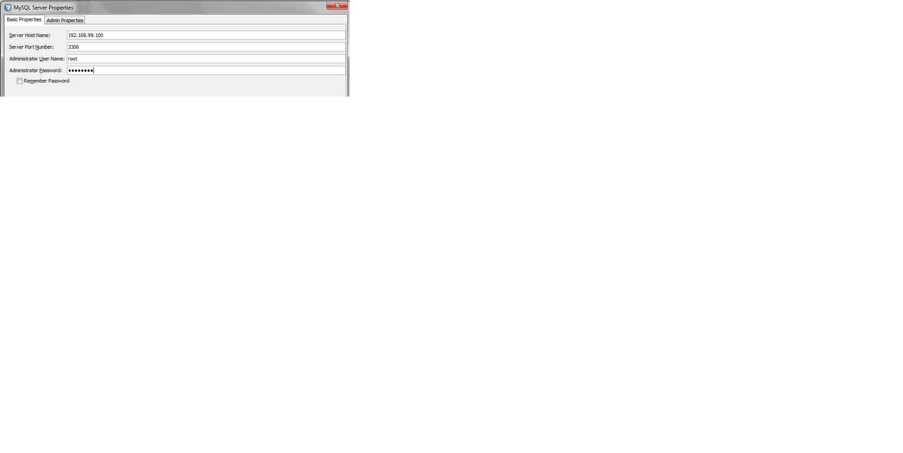
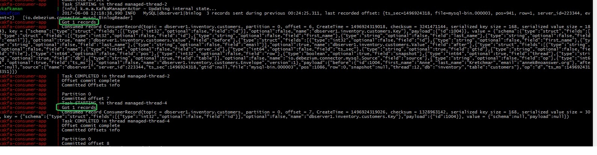
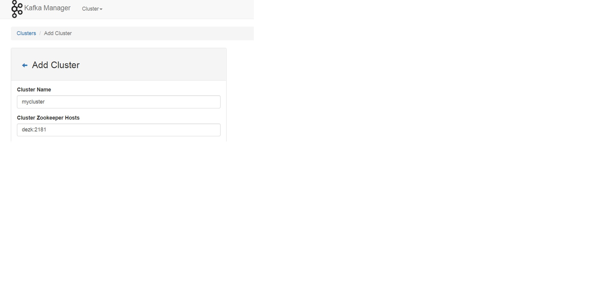
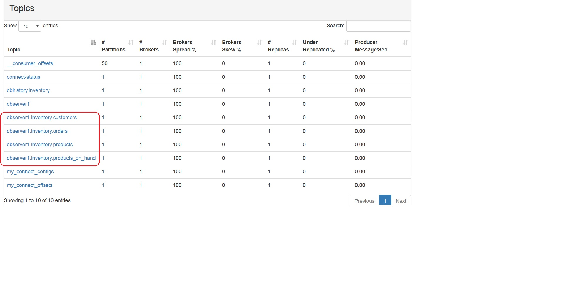
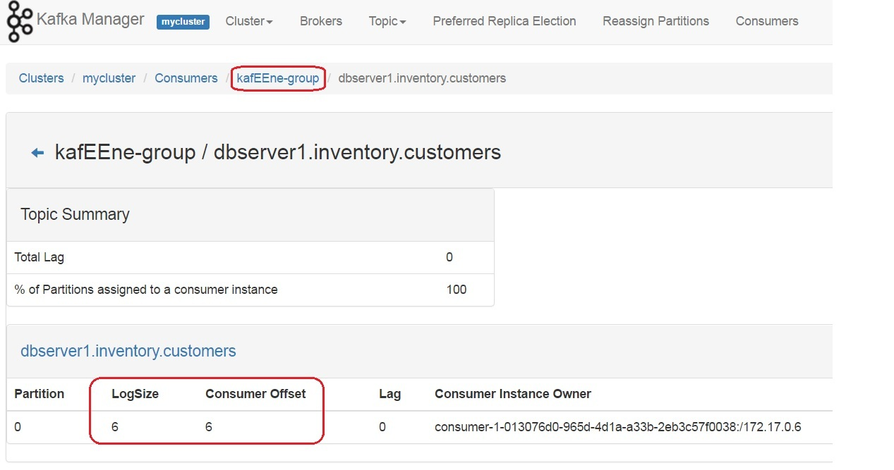

Test drive [**Debezium**](http://debezium.io), quickly...

### Build consumer app

`mvn clean install` - this will produce a WAR in `target` directory

### Bootstrap using `docker-compose up --build`

This will start Docker containers - **Debezium Zoookeeper**, **Debezium Kafka**, **Debezium MySQL** (example), **Debezium Kafka Connect**, (a Java EE based) [**Kafka Consumer**](https://abhirockzz.wordpress.com/2017/06/01/kafeene-2-kafka-concurrency-utilities/) and [**Yahoo Kafka Manager**](https://hub.docker.com/r/sheepkiller/kafka-manager/)

Wait for all the containers to start before proceeding....

### Create `Kafka Connect` connector 

Please substitute your Docker host IP which you can get using `docker-machine ip`. This is the same step as per [Debezium tutorial](http://debezium.io/docs/tutorial/). The only difference is that MySQL (`demysql`) and Kafka (`dekaf`) host names have been changed (as per Docker container names in `docker-compose.yml`). You should see a `201 Created` response

`curl -i -X POST -H "Accept:application/json" -H "Content-Type:application/json" <DOCKER_OST_IP>:8083/connectors/ -d '{ "name": "inventory-connector", "config": { "connector.class": "io.debezium.connector.mysql.MySqlConnector", "tasks.max": "1", "database.hostname": "demysql", "database.port": "3306", "database.user": "debezium", "database.password": "dbz", "database.server.id": "184054", "database.server.name": "dbserver1", "database.whitelist": "inventory", "database.history.kafka.bootstrap.servers": "dekaf:9092", "database.history.kafka.topic": "dbhistory.inventory" } }'`

### Update & check

#### Connect to MySQL Docker container

You can do so using another Docker container as mentioned in the [Debezium tutorial](http://debezium.io/docs/tutorial/) or  an external client (I used one)

#### Execute some queries

Assuming you have connected to MySQL, execute read queries such as `SELECT * FROM customers` or an update query `UPDATE customers SET first_name='Anne Marie' WHERE id=1004;` - you will see that the consumer picks up the records which contains the payload (MySQL info) in JSON form and its schema as well (which can be used to parse the payload)

### Setup Yahoo Kafka Manager

Browse to `http://<DOCKER_HOST_IP>:9000`, choose **Add Cluster** from the **Cluster** menu (ignore Kafka version for now)

You should see the topics created by the Debezium Kafka Connector

Check the (Java EE) consumer in Yahoo Kafka Manager (using the **Consumers** menu)

### To quit

`docker-compose down -v`

